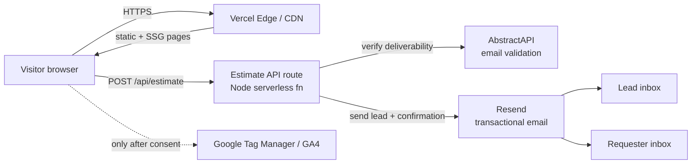

# Architecture

MyHealth Haven is a **content / marketing website** for a medical-travel
facilitator. It is a statically-generated and server-rendered Next.js (App
Router) app deployed on Vercel. The only dynamic, stateful surface is a single
lead-capture form.

There is **no user authentication, no database, and no stored user data.** A
lead submitted through the estimate form is emailed and is not persisted by the
application.

## Tech stack

| Concern        | Choice                                                 |
| -------------- | ------------------------------------------------------ |
| Framework      | Next.js 16 (App Router) + React 18                     |
| Build / dev    | Turbopack                                              |
| UI             | Material UI (MUI) v7 + Emotion, Tailwind CSS           |
| Animation      | `motion`                                               |
| Content        | Static data (`src/data`) + markdown (`react-markdown`) |
| Email delivery | Resend (transactional API)                             |
| Email hygiene  | AbstractAPI email validation (optional) + DNS check    |
| Analytics      | Google Tag Manager / GA4 (consent-gated)               |
| Hosting / TLS  | Vercel (automatic TLS + CDN)                           |
| Tests          | Vitest + Testing Library                               |

## System context

The dashed line is loaded only after the visitor accepts analytics in the
consent banner (`src/components/AnalyticsConsent.jsx`).

## Estimate request flow

The form lives at `/estimate` (`src/views/Estimate.jsx`) and posts JSON to
`src/app/api/estimate/route.js`. The route applies, in order:

1. **Config guard** — returns 500 if `RESEND_API_KEY` is unset.
2. **Sanitization** — `normalizeText` trims/collapses whitespace and bounds
   length per field; `sanitizePhone` strips non-digits.
3. **Honeypot** — a hidden `website` field; if filled, the request is silently
   accepted (200) and dropped without sending email.
4. **Validation** — required fields + email/phone format.
5. **Rate limiting** — per-IP, in-memory sliding window (default 5/min). See
   [ADR-0005](docs/adr/0005-in-memory-rate-limiting.md).
6. **Email deliverability** — disposable-domain block → AbstractAPI (if keyed)
   → DNS MX/A/AAAA fallback.
7. **Delivery** — lead email to the business inbox + a confirmation email to the
   requester, via Resend, with retry-with-backoff and a content-derived
   `Idempotency-Key`. All user-supplied values are HTML-escaped in the email
   body.

## Trust boundaries

- **Browser → CDN/route:** untrusted input. Everything from the client is
  sanitized, validated, length-bounded, and HTML-escaped before use. A strict
  Content-Security-Policy and other security headers are applied to every
  response (`next.config.mjs`). See [ADR-0004](docs/adr/0004-security-headers-and-csp.md).
- **Route → Resend / AbstractAPI:** outbound to trusted third parties over
  HTTPS, authenticated with server-only API keys. The AbstractAPI URL is locked
  to a fixed host to prevent SSRF via misconfiguration.
- **Secrets** never reach the browser; they are read from environment variables
  at request time on the server.

## Rendering & caching

- Marketing/content pages are statically generated (`○ Static`) or SSG with
  `generateStaticParams` (`●`) and served from the Vercel CDN.
- `/api/estimate` is the only dynamic (`ƒ`) route.
- `sitemap.xml` and `robots.txt` set `s-maxage=3600`.
- Images go through `next/image` + `sharp`.
- Cache invalidation happens automatically on each deploy (immutable build
  output). There is no application-managed cache to invalidate.

## Configuration

All runtime configuration is via environment variables (see `README.md` for the
full list): `RESEND_API_KEY`, `ESTIMATE_FROM_EMAIL`, `ESTIMATE_TO_EMAIL`,
`ESTIMATE_RATE_LIMIT_MAX`, `ALLOWED_ORIGINS`, `EMAIL_VERIFIER_API_KEY`,
`ESTIMATE_BLOCK_DISPOSABLE_EMAILS`, `NEXT_PUBLIC_GTM_ID`.

## Related documents

- [Security policy](SECURITY.md)
- [Disaster recovery, RTO & RPO](docs/disaster-recovery.md)
- [Data retention & deletion](docs/data-retention.md)
- [Architecture Decision Records](docs/adr/README.md)
